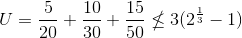

# Exercise 9 - Scheduling

## Properties

### Task 1:
 1. Why do we assign priorities to tasks?
 By using priorities, we can assure that tasks with shorter deadlines are completed first
 2. What features must a scheduler have for it to be usable for real-time systems?
 The scheduler must be predictable, 

 

## Inversion and inheritance

| Task | Priority   | Execution sequence | Release time |
|------|------------|--------------------|--------------|
| a    | 3          | `E Q V E`          | 4            |
| b    | 2          | `E V V E E E`      | 2            |
| c    | 1 (lowest) | `E Q Q Q E`        | 0            |

 - `E` : Executing
 - `Q` : Executing with resource Q locked
 - `V` : Executing with resource V locked

### Task 2: Draw Gantt charts to show how the former task set:
 1. Without priority inheritance
 
 2. With priority inheritance

### Task 3: Explain:
 1. What is priority inversion? 
 Priority inversion is when a task with higher priority is indirectly interrupted/paused by a task with lower priority, effectively inverting the two tasks priority. I.E task 2 Gantt chart without priority inheritance
 2. What is unbounded priority inversion?
 Unbounded priority inversion is when a task (mid priority) is preventing a lower prioority task from releasing a ressource that the high priority task is waiting for
 3. Does priority inheritance avoid deadlocks?
 No

## Utilization and response time

### Task set 2:

| Task | Period (T) | Exec. Time (C) |
|------|------------|----------------|
| a    | 50         | 15             |
| b    | 30         | 10             |
| c    | 20         | 5              |

### Task 4:
 1. There are a number of assumptions/conditions that must be true for the utilization and response time tests to be usable (The "simple task model"). What are these assumptions? Comment on how realistic they are.
 - Fixed set of periodic tasks
 - Independent task with known periods
 - Constant worst case execution times
 - Deadlines equal to their periods
 - They run on a single processor where overheads run in zero time
 
 most of these are fairly realistic, but some require workaround.
 
 2. Perform the utilization test for the task set. Is the task set schedulable?
 
  
 
 Therefore, it is not schedulable.
 
 3. Perform response-time analysis for the task set. Is the task set schedulable? If you got different results than in 2), explain why.
 
 
 4. (Optional) Draw a Gantt chart to show how the task set executes using rate monotonic priority assignment, and verify that your conclusions are correct.

## Formulas

Utilization:  

Response-time:  

